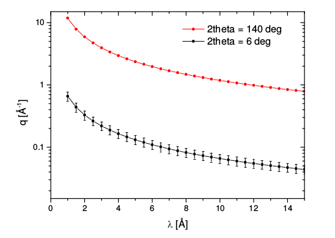

# Visualizations

### Currently

##### SliceViewer

The slice viewer can either hold an *MDEventWorkspace* or an *MDHistoWorkspace*.
The slice viewer is used by the instrument scientists to compare the
found and evaluated peaks against the data. This often requires some sort of
zoom into the data set, which requires a histogram-type slice of the data, which
requires at some point an *MDEventWorkspace*.

##### InstrumentView

This is only used by the instrument scientists at ISIS. It might be that they
could work solely using the *SliceViewer*. However, I have found that viewing
peaks, especially weak(ish) peaks in the *InstrumentView* provides considerably
better results. The *InstrumentView* requires the original *MatrixWorkspace* since
it displays the data in detector space. The scientists edit the peaks that have
previously been found using one of the peak-finding algorithms, e.g. *FindPeaksMD*.

### Brainstorming: Solutions to make large data available in a viewer

1. Save the multi-dimensional data to disk and load as a file-backed workspace into
   a viewer. Experimented with `23GB` WISH data set. It took 16 minutes to generate
   and when loaded was only `450MB` in RAM. Operating the *SliceViewer* with dynamic
   rebinning worked well.
2. Save only the block structure to disk (provided we use the current
   *MDEventWorkspace* structure). The *MDEventWorkspace* will have a finer mesh
   in regions where instrument scientists want to zoom in.
3. Save the data in a very fine grained histogram-type workspace. The grain size
   would be determined by
   to specify the amount of available resources to hold the histogram-type workspace
   and this could determine the binning. Then we need to teach *BinMD* to bin
   *MDHistoWorkspace* types. This approach is limited by the available system
   resources on the client machine. Especially for high-dimensional scenarios
   this might lead to an issue.
4. Hold the distributed multi-dimensional, event-type workspace
   (provided we have something like this) in memory and send a query for a slice.
   The slice is returned and we can plot it. This essentially would be a client
   server approach with a long-living session. This should produce slices
   in the low tens of megabyte range. However this is a blue sky solution.

#### Re Option 2
This will most likely lead to unsatisfactory results with the instrument scientists.

#### Re Option 3

For CSEPC we have a resolution of about 0.5% for both then energy and the momentum transfer (see [here](../requirements_and_discussions/log.md)).
The minimum Q value according to `CSPEC_resubmission.pdf` is $0.06 \AA^{-1}$ and the
maximum Q value is around  $10 \AA^{-1}$. This with a resolution of 0.5% this means
we have a binning interval of  $0.06*0.005 \AA^{-1}=0.0003\AA^{-1}$. This would lead
to a number of about $3.7e13$ cells only for the momentum part. Hence this approach
is not really feasible.

In addition we need to consider the energy transfer, which is depicted below. From
this we take the range to be 40meV (is this valid?) and from `CSPEC_resubmission.pdf`
we take a smallest resolution of $8\mu eV$. This would lead to a grid of about
5000 cells, which is similar to [other energy estimations](../other/instruments_and_resolutions.md).

#### Re Option 4
From what Simon has said we need to be frugal with the compute resources and a
user who wants to visualize data cannot claim a substantial part of the cluster
for her visualization for a long time (which would happen if we made the
cluster available in an interactive way.)

### Saving event data for visualization

It becomes apparent that the main use case for event-based MD data structures
are because
