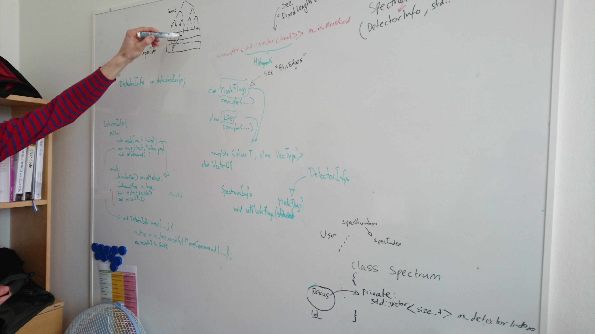
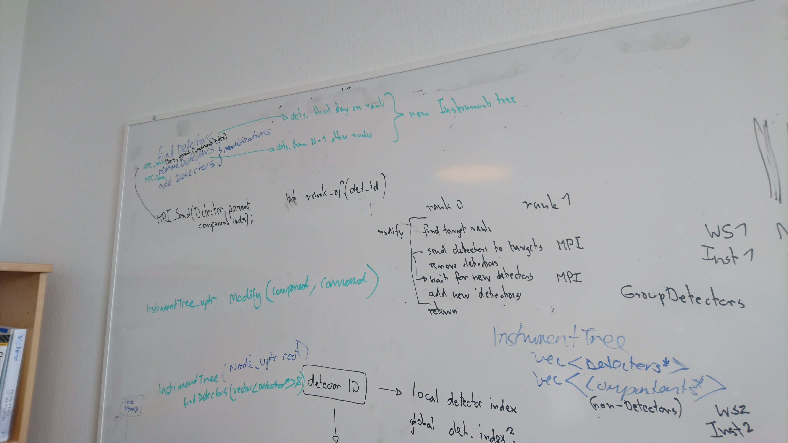
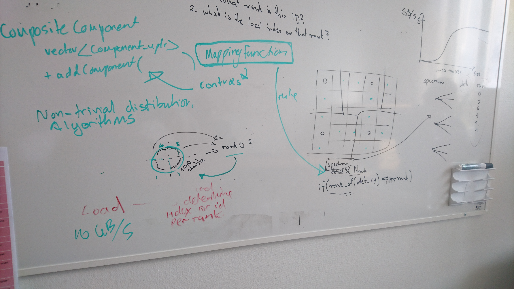
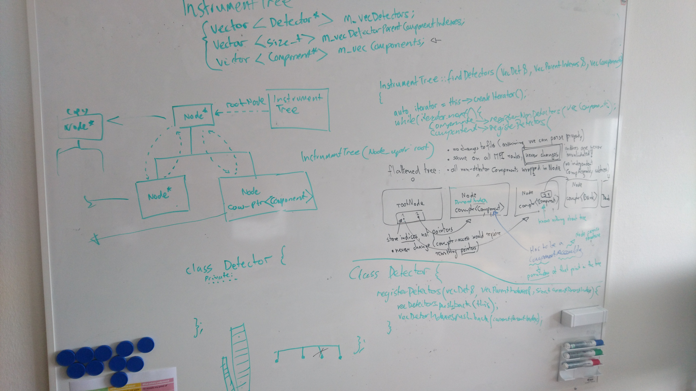
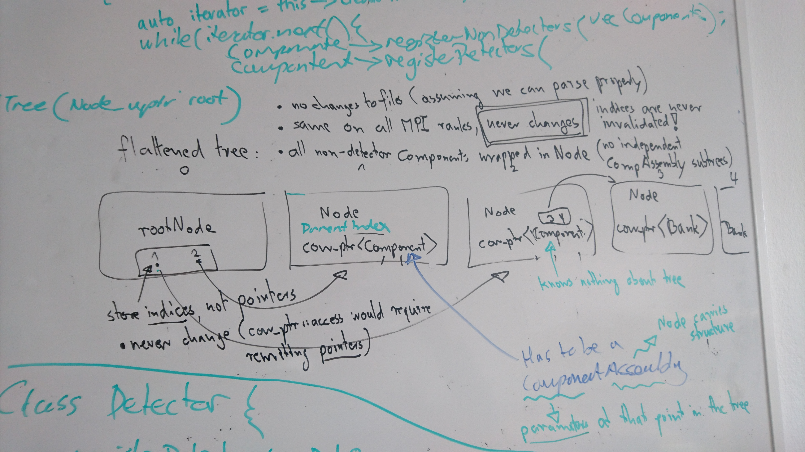

#Items Coded into Prototype

Prototype lives [here](https://github.com/DMSC-Instrument-Data/instrument-prototype)

* [~~Spectrum and Detector Info~~](#spectrum-info-and-detector-info)
* [~~Complex beam paths~~](#complex-beam-paths)
* [MPI support](#mpi-support)
* [~~Flattened InstrumentTree~~](#flattened-instrumenttree)
* [Step scans](#step-scans)
* [Continuous scans](#continuous-scans)

Other Non-Designed Features required on Prototype

* Persistance. How to load and save.
* Write performance including rotations.


## Spectrum-Info and Detector-Info

- What we previously labelled `GeometryDataArray` is quite similar to what is done for the new `Histogram` type.
  - For example, `class MaskFlags` contains: `cow_ptr<FixedLengthVector> m_data`
  - `class L2s` etc.
- `DetectorInfo`:

  ```cpp
  class DetectorInfo {
    private:
      InstrumentTree m_tree;
      MaskFlags m_maskFlags;
      L2s m_l2s;
      // Need a flag that tells whether or not L2s are valid (could zero the
      // cow_ptr, but that would result in expensive reallocations).
      // On the other hand, maybe this is premature optimization?
      bool m_l2sValid;

    public:
      // Not thread safe, cannot be enforced at the instrument level
      void modify(const Command &cmd) {
        m_tree = m_tree.modify(cmd);
        m_l2sValid = false;
      }
      // Can this be considered thread-safe if indices to not collide?
      // Probably yes, must verify cow_ptr::access()
      // Careful: std::vector<bool> may cause issues.
      void mask(size_t index);

  };
  ```
- `SpectrumInfo` and `DetectorInfo` can share, e.g., the same `MaskFlags`. Correctness would be enforced by implicit size check by `FixedLengthVector`.
- Need a type `Spectrum`, storing a vector of detector indices.
- `SpectrumInfo`:

  ```cpp
  SpectrumInfo::getL2(size_t index) {
    if(!m_l2s)
      initL2();
    return m_l2s(index);
  }
  SpectrumInfo::initL2() {
    for(size_t i=0; i<m_spectra.size(); ++i) {
      Position tmp(0.0, ..);
      for(detector_index : m_spectra[i].detectors) {
        // Currently need to directly access InstrumentTree.position(detector_index);
        tmp += m_detectorInfo->position(i);
      }
      // divide by size of detector list
      // compute distance to sample
    }
  }
  ```




## Complex beam paths

- Add:
  - `class PathComponent`
  - `class Path` ordered list of indices referring to `PathComponent` in `InstrumentTree`
- `InstrumentTree`:
  ```cpp
  class InstrumentTree {
    std::vector<Detector *> m_detectors; // as we have currently
    // new, does not include detectors!
    std::vector<PathComponent *> m_pathComponents;
  };
  ```

- `PathComponent`:
  ```cpp
  class PathComponent : public Component {
    // Internal scattering length, e.g., arc length of guide, could be computed
    // in a complex way, in the most extreme case by actual ray tracing.
    double length() const;
    // Allows straight sections without actually specifying them, e.g.,
    // exitPoint of sample can give simple straight distance to detectors,
    // if there are no other components.
    // Default to position of component, otherwise it could be, e.g., the start
    // and end of a guide.
    Position entryPoint() const;
    Position exitPoint() const;
  };
  ```

- `Path`:
  ```cpp
  class Path {
    // Index into vector of InstrumentTree (see above)
    // Need to make sure to rebuild this when InstrumentTree is invalidated
    // (driven by DetectorInfo, e.g., by DetectorInfo::setInstrument()).
    std::vector<size_t> m_pathComponentIndex;
    // Detector at the end of the path. Detectors are never path components!
  };
  ```

- `Path` instances are part of `DetectorInfo`.
  ```cpp
   class DetectorInfo {
     private:
       // For computing L2
       // Option 1
       Path m_path;
       // Option 2
       std::vector<Path> m_paths;
       // Option 3
       // Most flexible. Paths are likely to be the same for many instruments,
       // making option 2 inefficient.
       // Paths to monitors will be different, ruling out option 1.
       std::vector<shared_ptr<Path>> m_paths;
  
       // For computing L1
       Path m_source_to_sample;

     public:
       double getL2(size_t detector_index) {
         return m_paths[detector_index].getL(position(detectorIndex));
       }
  };

  Path::getL(Position detectorPosition) {
    double l = pathComponents[0].length();
    for(size_t i=1; i<pathComponents.size(); ++i) {
      l += distance(pathComponents[i].entryPoint(), pathComponents[i-1].exitPoint());
      l += pathComponents[i].length();
    }
    l += distance(pathComponents[-1].exitPoint(), detectorPosition);
  }
  ```
  
### Details on Complex Beam Paths

#### Where Does the Path Information Come From?

In our current design we have placed the paths `CowPtr<std::vector<Path>> m_paths` on the `DetectorInfo`. `m_paths` has the same size as the number of detectors, so it will be possible to calculate l2 as our function `getL2` above describes.

* While the paths should live on the `DetectorInfo` and not on the `InstrumentTree`. The `std::vector<Path>` must be sourced from elsewhere. The informatoin on the paths will ultimately be sourced from the instrument definition (or future equivalent). Nowhere else will describe this information, it cannot be derived. 
* Given the above point. We should have factories for producing this paths vector. A default implementation could assume the `Source->Sample->Detector` path:

```cpp

// Client usage
std::unique_ptr<PathFactory> pathFacotry = std::make_unique<SourceSampleDetectorFactory>();
DetectorInfo detectorInfo(std::move(instrumentTree), std::move(pathFactory));

//.....

// Constructor
DetectorInfo::DetectorInfo(InstrumentTree&& instrumentTree, std::unique_ptr<PathFactory> pathFactory) : m_instrumentTree(instrumentTree), m_pathFactory(pathFactory) {
...
/* This is key. We can now use the FactoryMethod to determine HOW to build the paths. But use the InstrumentTree for WHAT to build it around. */
m_paths = m_pathFactory.create(m_instrumentTree);

}
```
* `DetectorInfo::modify` does NOT need to reset the flight paths, **because it only stores indexes** to the `PathComponents*` and these indexes do not change even though the individual `PathComponents*` may be updated. The `l2` values based on these flight paths do however need to be updated.
* Related: We decided that we should we initalize the `m_l2` vector as we currently do based on processing the paths. `DetectorInfo::l2` does not perform lazy computation to extract an `l2`, it is done at construction time via the `PathComponents`. 


## MPI support

- If we keep the full instrument on each MPI rank, the instrument/geometry code does not scale (speed up) at all when the number of MPI ranks is increased.
  For example, we would always need to compute the full set of L2 distances in `DetectorInfo`.
  - Consequence: Must split up the instrument.
- Split by **spectrum**, **not** by **detector**.
  - Otherwise things get very complicated if detectors for a given spectrum are scattered accross more than one MPI rank.
- Must move detectors from one rank to another when detector grouping into spectra changes.
  - **Important**: The grouping into spectra can be different for every workspace, so we will also have instrument trees with different distributions to MPI ranks.
  - Examples for algorithms that change the grouping of detectos into spectra and thus require moving detectors are: `GroupSpectra`, `SumSpectra`, `DiffractionFocussing`, and algorithms for azimuthal integration for SANS.
- For loading instruments, communicating with other MPI ranks, and for redistributing detectors we need have a **mapping function**:
  - Based on the total number of MPI ranks (and optionally the total number of spectra) it returns a unique rank for a given spectrum index.
  - Example:
    ```cpp
    int getRankForSpectrum(size_t spectrumIndex) {
      return spectrumIndex % nRank;
    }
    ```
  - This mapping is flexible, and arbitrary functions with this signature can be used for mapping. In particular, the mapping function may need to be adjusted for good load balance, depending on the instrument, experiment, and the algorithms in the corresponding reduction workflow.
  - The mapping for detectors follows from this mapping for spectra in combination with the specific grouping of detectors into spectra in a given workspace.

    ```cpp
    // Rough analogue to current implementation (no changes)
    class Workspace {
      std::vector<Spectrum> m_spectra;
    };
    // Rough analogue to current implementation (no changes)
    class Spectrum {
      std::vector<size_t> m_detectorIndices;
    };
    
    int rank = getRankForSpectrum(spectrumIndex);
    // all these detector indices are on the computed rank
    auto detectorIndices = workspace.getDetectorIndices(spectrumIndex);
    ```

- Redistribution of an instrument:
  - We want to remove a detector from the instrument tree on rank A and insert it on rank B.
  - To this end, we need to be able to identify and transmit the parent of a detector in the instrument tree.
    In the new instrument tree desig this is slightly more complex than in the current implementation, since components to not store their parent.
  - We thus introduce a new vector of non-detector components in the instrument tree. Indices into this vector uniquely identify a parent component of a detector. The indices must be identical on all MPI ranks. In particular, this implies that all non-detector components must be present on all MPI ranks.
    ```cpp
    class InstrumentTree {
      std::vector<Detector *> m_detectors;
      std::vector<Component *> m_components;
       }
    ```
  - Redistribution can now happen roughly as follows:
    ```cpp
    // 1) 
    // We need to find out which spectra have to be removed from this rank. There are
    // many options for this (depending on use case), but one is to simply specify the
    // new desired configuration. This is defined by a partitioning class or method.
    MyNewPartitioning targetPartitioning(numberOfRanks);
    // 2)
    // We need to extract data from the instrument and put it into a buffer such that
    // it can be sent out with MPI. There is one buffer for each target rank (or a
    // vector of buffers).
    // 2a) Data for each spectrum has to be extracted
    // 2b) Data for each detector has to be extracted
    std::vector<SpectrumDataBuffer> spectrumAndDetectorData = workspace.split(targetPartitioning);
    // Internally, many things are happining:
    MatrixWorkspace::split(const Partitioning &partitioning) {
      std::vector<SpectrumDataBuffer> buffer(partitioning.numberOfPartitions());
      for(size_t i=0; i<numberOfHistograms(); ++i) {
        int partition = partitioning.indexOf(i);
        buffer.partition[partition].addHistogram(this->histogram(i));
        buffer.partition[partition].addSpectrum(this->spectrumInfo.spectrum(i));
        buffer.partition[partition].addDetectors(this->spectrumInfo.spectrum(i).detectors);
      }
    }
    
    // 3)
    // Send partitioned data
    for(int rank=0; rank<targetPartitioning.numberOfPartitions(); ++rank)
      MPI_Send(spectrumAndDetectorData[rank], rank);
      
    // 4)
    // Receive and merge data
    std::vector<SpectrumDataBuffer> buffer(targetPartitioning.numberOfPartitions());
    for(int rank=0; rank<targetPartitioning.numberOfPartitions(); ++rank)
      MPI_Recv(buffer[rank], rank);
    SpectrumDataBuffer spectrumData;
    for(const auto & item : buffer)
      spectrumData.addData(item);
      
    // 5)
    // Build new instrument based on 'spectrumData'
    // TODO
    ```
    
    (leaving in the old description for comparison)
    ```cpp
    /* One outer vector element for each target rank.
       component indexes std::vector<size_t>, which are elements of the outer vector,
       are indexes of DETECTOR components Grouped by Spectrum. A function pointer is used to reference the rank-splitting function.
    */
    std::vector<std::vector<size_t>> componentIndices =
        instrumentTree.findDetectors(getRankForSpectrum);
    /* We store copies of the Detectors grouped by Spectrum. Spectrum are grouped by Rank (outer vector). All Detectors are removed
       from the host InstrumentTree in the process of doing this.
    */
    std::vector<std::vector<Detector>> detectors =
        instrumentTree.removeDetectors(componentIndices);
    // Instrument tree is now purged of detectors
    for(int rank=0; rank<nRank; ++rank)
      MPI_Send(detectors[rank], componentIndices[rank], rank);
    
    std::vector<std::vector<size_t>> newComponentIndices(nRank);
    std::vector<std::vector<Detector>> newDetectors(nRank);
    for(int rank=0; rank<nRank; ++rank)
      MPI_Recv(newDetectors[rank], newComponentIndices[rank], rank);

    // This doesn't look right to me?
    addDetectors(newComponentIndices, newComponentIndices);
    ```

- Example for redistribution: `GroupDetectors`:
  - `N` input spectra.
  - `M` output spectra, `M <= N`.
  - Instrument and spectra of input workspace are distributed according to mapping function `getRankForSpectrum`.
  - Create output instrument by redistributing detectors in a copy of the the input instrument.
  - Group detectors into spectra locally (temporary).
  - Send temporary spectra to target ranks, based on `getRankForSpectrum` (based on *new* spectrum indices).
  - Receive temporary spectra from other ranks, based on `getRankForSpectrum` (based on *old* spectrum indices).
  - Sum up temporaries to obtain spectra for output workspace.





### Finding parents

How do we find parent indices in the current `InstrumentTree`?

- Extend `InstrumentTree`:
  ```cpp
  class InstrumentTree {
    std::vector<Detector *> m_detectors;
    std::vector<size_t> m_detectorParentComponentIndices;
    std::vector<Component *> m_components;
  };

  void InstrumentTree::findDetectors(detectors &, parentIndices &, components &) {
    auto iterator = this->createIterator();
    while(iterator.next()) {
      iterator->registerNonDetector(components);
      iterator->registerDetector(...);
    }
  }

  void Detector::registerDetectors(detectors &, parentIndices &, currentParentIndex) {
    detectors.push_back(this);
    parentIndices.push_back(currentParentIndex);
  }
  ```




## Flattened InstrumentTree

The current instrument prototype requires a fair bit of pointer handling, in particular also during modifications.
An alternative could be as follows:

- `Node` tree is flattened into a vector, held by `InstrumentTree`.
- `Node` represents a building block of the tree structure.
- `Component` holds *data* (such as bank position) or vector of detectors (no multi-level assembly concept in here, in contrast to current instrument).

```cpp
class InstrumentTree {
  std::vector<Node> m_nodes;
};

class Node {
  // Could be a detector, but in general it is not.
  // If it is an assembly, it is at most depth one (with detectors as leaves).
  cow_ptr<Component> m_component;
  // Indices refer to vector in InstrumentTree
  std::vector<size_t> m_children;
  // Indix refers to vector in InstrumentTree
  size_t m_parent;
};
```

- Every component that is not a detector is wrapped in a node.
  No changes to `idf` files should be necessary.
- The `Node` vector in `InstrumentTree` never changes (for a given instrument).
  - Indices are never invalidated (no need for updating pointers in contrast to the full tree we have in the other design).
  - Same on all MPI ranks.
- `const`-only access to components is still essential.
- Modification mechanism is essentially the same (via `InstrumentTree::modify()`).
- Can avoid copy of a detector array:
  - When we rename a bank, this currently copies all detectors.
  - By separating bank meta-data from the detector array this copy can be avoided.
  - There are two ways to do this: (1) a bank could have two cow pointers, one for meta data and one for the detectors array, or (2) add another node below a bank that wraps the detector array.
- There should be cascading and non-cascading `Commands`. For example:
  - Renaming the root node is non-cascading (banks should not be renamed).
  - Moving the root is cascading and should move all banks.




## Step scans

How to get spectrum position?
- Detector positions are time dependent.
- Spectrum positions are fixed and not time dependent.
- As a consequence a detectors may apear in multiple spectra.

How to implement this?
- A workspace now has roughly `nDetector * nTimePositions` spectra (assuming no grouping).
- Average over posititions of all detectors, by querying detector position for given time.

- Extend detector:
  ```cpp
  class MovableDetector {
  private:
    // As before
    Position translation;
    Matrix rotation;
    // New: position information (from metadata logs)
    // Could potentially be partially shared (but is not globally the same).
    std::vector<double> times;
    // Stores absolute positions, local to every detector.
    std::vector<Position> positions;
  };
  public:
    // This is not exposed on SpectrumInfo`, a spectrum has a fixed position!
    Position getPosition(size_t timeIndex) {
      return positions[timeIndex];
    }
    double getTimeIndex(AbsoluteTime time) {
      // use this->times to find best discrete time index.
      return findBestMatchingTimeIndex(time);
    }
  ```

- Extend spectrum:
  ```cpp
  class Spectrum {
    // Indices into time/position arrays in MovableDetector
    // Note that this needs to be a vector (i.e., one index for each detector
    // in the vector below), since MovableDetector::times is *not* globally
    // the same.
    std::vector<size_t> timeIndices;
    // Fine as long as there are no detector groups...
    std::vector<size_t> detectors;
    // ... do we need this? Note: groups should not be allowed to be time dependent!
    std::vector<std::vector<size_t>> detectors;
  };
  ```

- Do we need to be concerned about increased instrument size? We now have several additional vectors on each detector.
  - Probably not, since the corresponding event/histogram information will likewise be bigger for a moving instrument and the addition bytes for positions are not relevant.


## Continuous scans

- Consider spectra as fixed in space (as for the step scan), detectors move through these positions.
- Cannot go straight to spectrum, otherwise we cannot to detector-dependent normalization.
  - Consider, e.g., a rocking scan. We could "compress" data by merging contributions to spectrum X by detector Y at different times, due to the cyclic motion. However, corrections like time-dependent efficiency due to varying gas pressure complicate this. Such corrections must be done before any compression.
- After corrections that depend on both absolute time and detector ID, we can create spectra:
  - Define length scale, corresponding to with of band in diagram.
  - Transform into spectra (basically this is a transformation into a fine-grained step scan).
- Or just keep everything in an `MDEventWorkspace`, to keep it truly continuous.


## Data Sources

We need to have a mechanism of fully saving and loading an instrument.

* We must be able to save an `InstrumentTree` created in-memory (current Mantid `Instrument` cannot do this).
* We need to retain the ability to add and remove the saving/loading formats without modifying the core domain code for the instrument. 
* The domain code should not be aware of the saving/loading mechanism
* I propose taking a `Repository` approach whereby the persistence of the `InstrumentTree`, `DetectorInfo`, `SpectrumInfo` and other related types is handled by an orthogonal family of `Repositories`.

Repository abstract types may look like this.
```cpp

/// Pure virtual
class InstrumentTreeRepository {
public:

virtual void saveInstrument(InstrumentTree& instrument, Location location) const = 0;

virtual InstrumentTree loadInstrument(Location location) const = 0;

};

/// Pure virtual
class DetectorInfoRepository {

virtual DetectorInfo loadDetectorInfo(Location location) = 0;

virtual void saveDetectorInfo(const DetectorInfo& detectorInfo, Location location) = 0;

};

```


